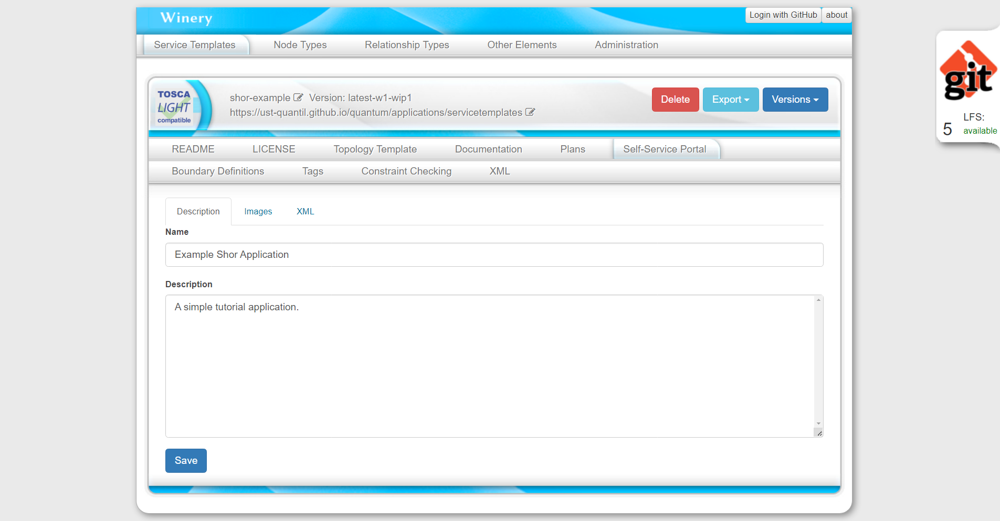
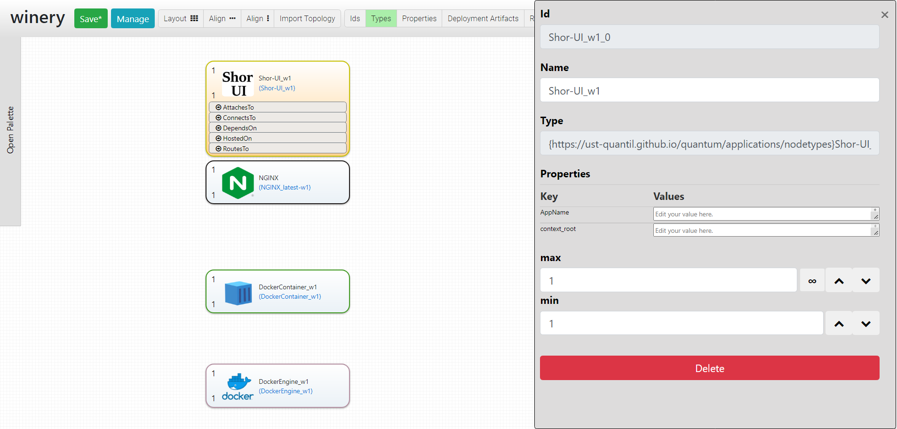
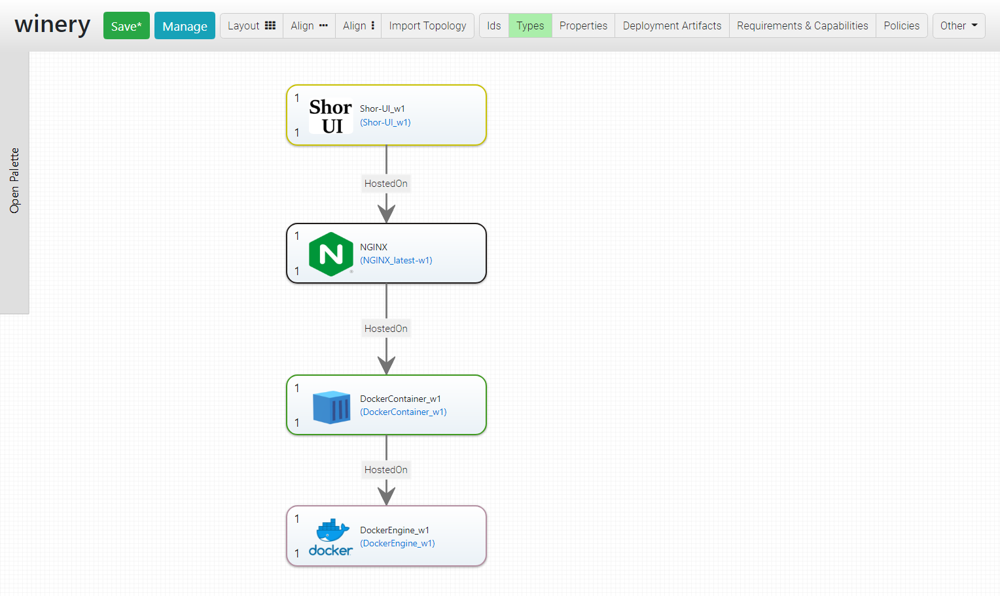
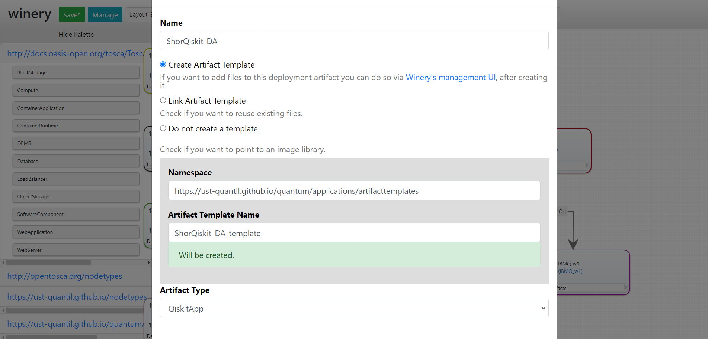
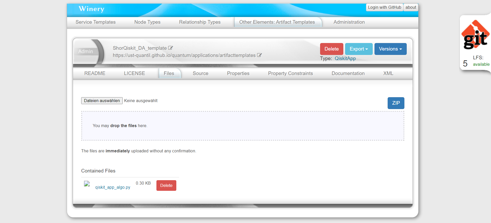
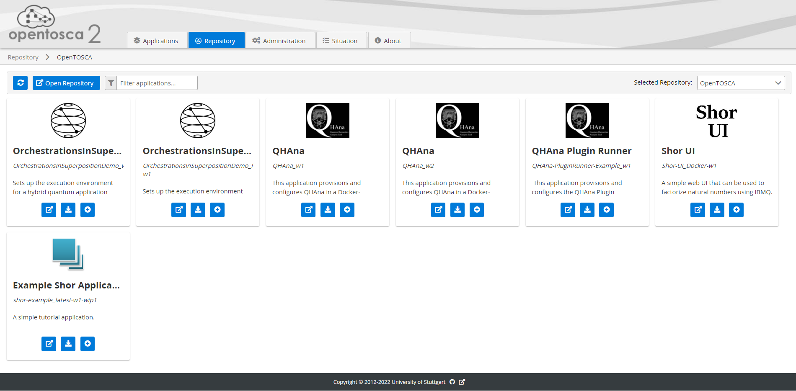
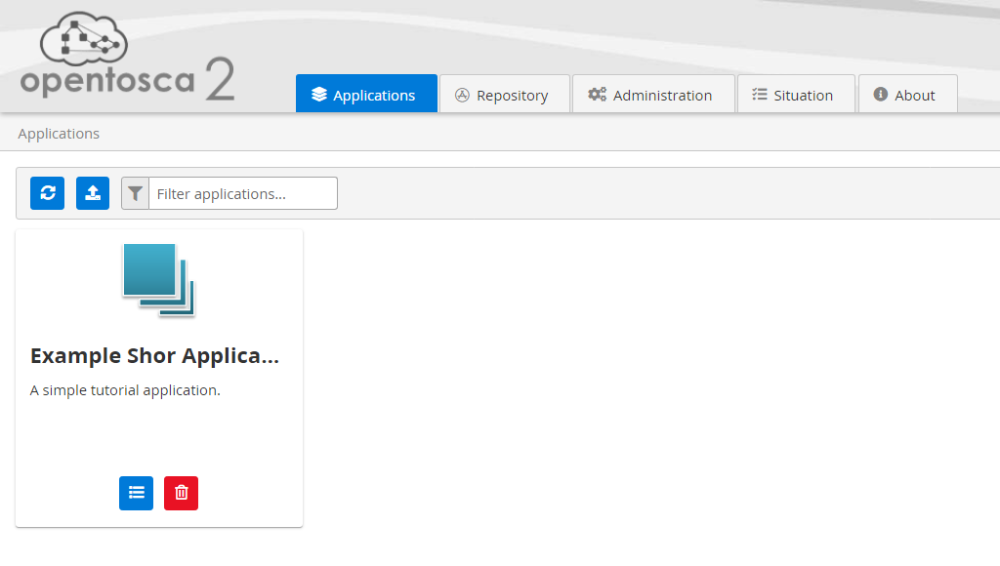

# Tutorial: Model and Deploy an Application with OpenTOSCA

This tutorial takes you through the steps to model and deploy a simple application using OpenTOSCA in the development docker-compose setup.
The application modeled in this tutorial is a simple Angular app hosted on NGINX running inside a docker container.

:information_source: Terms in *italics* can be found in the [glossary](tosca-glossary.md).

**Requirements:**

 *  GIT (optionally GIT-LFS)
 *  Docker & Docker Compose
 *  At least 6GB RAM free for the OpenTOSCA docker-compose

Before starting with this tutorial clone the <https://github.com/OpenTOSCA/opentosca-docker> repository and read through the README once.

## Model the Application

### 1. Starting OpenTOSCA

Before starting the OpenTOSCA docker compose file change the `WINERY_REPOSITORY_URL` to `https://github.com/UST-QuAntiL/tosca-definitions-qc-applications`.

Then start OpenTOSCA according to the instructions in the <https://github.com/OpenTOSCA/opentosca-docker> repository.
Remember the `PUBLIC_HOSTNAME` from this step!

### 2. Creating the Service Template

Open the Winery in your browser (`http://${PUBLIC_HOSTNAME}:8080` [replace `${PUBLIC_HOSTNAME}`] or <http://localhost:8080>).

Applications are modeled with *Service Templates*.
Create a new Service Template using the "Add new" button on the right.
Fill in the following values:

| Name | Value | Explanation |
|:-----|:------|:------------|
| Name | QHAna-Frontend | Service Template Name. No spaces allowed. |
| Versioning | latest | Enables versioning and creates a "latest" version. (This is optional) |
| Namespace | `https://ust-quantil.github.io/quantum/applications/servicetemplates` | Namespace where the Service Template should be put into. Can be found in the "Administration" tab of the Winery or in the [admin/namespaces/Namespaces.json](../admin/namespaces/Namespaces.json) file of this repository. |

Now create a "README", "LICENCE" and "Documentatation" as needed.
If you choose a predefined license make sure to fill in the correct copyright information.
This step may be omitted when only following this tutorial for testing purposes.

Fill in information about the application in the Service Template in the "Self-Service Portal" tab.
Set a name, a description and optionally an icon and preview image.
The self-service portal information is used later in the OpenTOSCA UI.
Make sure to save your changes.

:bangbang: Make sure to save the self-service portal information or your changes will be lost.

### 3. Define the Topology

Open the "Topology Template" tab of the QHAna-Frontend *Service Template* and open the topology editor by clicking the "Open Editor" button.
The editor will open in a new tab.

:warning: The editor does not auto-save. Make sure to **manually save** all changes **before leaving** the editor!

Drag the following nodes from the pallete on the left into the canvas:

| Node | Namespace | Explanation |
|:-----|:----------|:------------|
| DockerEngine_w1 | `http://opentosca.org/nodetypes` | The docker engine responsible for building and running the container.|
| DockerContainer_w1 | `http://opentosca.org/nodetypes` | The docker container hosting the QHAna frontend code. |
| NGINX_latest-w1 | `http://opentosca.org/nodetypes` | The webserver delivering the QHAna frontend code. |
| QHAnaUI_w1-wip1 | `https://ust-quantil.github.io/quantum/applications/nodetypes` | The QHAna frontend code. The node type is derived from `{http://opentosca.org/nodetypes}NGINX-Application_w1` |

Click on a *Node Template* to edit its *Properties* and to create new *Relationship Templates* by dragging one of the handles in the expanded Node Template to another node template.

Connect all node templates in the topology with "HostedOn" relationship templates.
Start with the QHAnaUI_w1-wip1 node template that is "HostedOn" the NGINX_latest-w1 node template that is "HostedOn" the DockerContainer_w1 node template that is "HostedOn" the DockerEngine_w1 node template.

### 4. Set the Node Template Properties

Use the menu above to show the properties in the node templates (click on "Properties" next to "Types").
Open the container properties and fill in "ubuntu:20.04" in the "ImageID" property.
Alternatively click on the node and edit the property in the sidebar on the right.
Now fill in the other properties:

| node template | property | value | explanation |
|:--------------|:---------|:------|:------------|
| DockerEngine_w1 | DockerEngineURL | `get_input: DockerEngineURL` | The URL to the docker engine that is used to create the containers. This tutorial uses the Docker-in-Docker (dind) container that is part of the OpenTOSCA docker-compose file. |
| DockerContainer_w1 | ImageID | `ubuntu:20.04` | The base image to use. |
| DockerContainer_w1 | ContainerPort | `80` | NGINX runs on port 80 so that port must be mapped outside. |
| DockerContainer_w1 | Port | `get_input: Port` | The user input Port. Provided at deployment time by the end user. |
| QHAnaUI_w1-wip1 | AppName | `qhana` | The app name is used as path to differentiate multiple NGINX apps hosted on the same NGINX server. |

:information_source: The value `get_input: Port` is a special value that is replaced by a user input before deploying the service template.
The name of the user input comes after the colon `get_input: <custom name here>`.
All properties with the same user input name in the same service template will **share** the value of the user input.

### 5. Add the Deployment Artifact

Next use the menu at the top to toggle the "DeploymentArtifacts" on (and hide the "Properties" again for better overview).
Open the "Deployment Artifats" of the QHAnaUI_w1-wip1 node template and click on "Add new Deployment Artifact".

| Input | Value |
|:------|:------|
| Name  | QHAna-UI_DA |
| Create Artifact Template | :radio_button: |
| Namespace | `https://ust-quantil.github.io/quantum/applications/artifacttemplates` |
| Artifact Template Name | QHAna-UI_DA_template |
| Artifact Type | ArchiveArtifact |

:bangbang: Save the topology now!

To upload the actual *deployment artifact* go back to the Winery after **saving** the topology.

The created artifact template can be found under the "Other Elements" tab at the top.

Click on the "Artifact Templates" button and search for the created artifact template name.
Open the files tab and upload the provided artifact template. <!-- TODO provide an artifact template (download link?) -->
(Alternatively build the artifact template from source by zipping the build output of a production build of the [QHAna-UI](https://github.com/UST-QuAntiL/qhana-ui#build).)

Now the service template is ready to be deployed.

## Deploy the Application

This part assumes that you have followed the first part from start to finish and have a running OpenTOSCA docker compose.

### 6. Load the CSAR from the Winery

Open the OpenTOSCA UI in your browser (`http://${PUBLIC_HOSTNAME}:8088` [replace `${PUBLIC_HOSTNAME}`]).

:warning: Do **not** use `localhost` to access the OpenTOSCA UI. The UI uses its URL to derive the URLs of the Winery and the Container. If you still experience problems with the following steps first read the [troubleshooting section](https://github.com/OpenTOSCA/opentosca-docker#troubleshooting) of the opentosca-docker repository.

Go to the "Repository" tab to see the list of applications that can be imported from the Winery.

Import the QHAna-Frontend application by clicking the :heavy_plus_sign: button of the card.
Do **not** check "Apply Management Feature Enrichment".
Wait for it to process before going to the next step.

Switch back to the "Applications" tab to verify that the application was imported correctly.

### 7. Create a new Instance

First click on the "Show details…" button of the QHAna-Frontend card (left of the trashcan button).

Create a new instance by clicking the :heavy_plus_sign: "Provision new instance…" button.

Select "initiate" in the dropdown and click on "next".
Provide values for the properties defined with `get_input: …` (see [4. Set the Node Template Properties](#4-set-the-node-template-properties)).

| Property | Value | Explanation |
|:---------|:------|:------------|
| DockerEngineURL | `tcp://dind:2222` | The address of the dind container. |
| Port     | `9990` | A port between `9990` and `9999` as only these ports are exposed by default in the dind container. (May be changed in the docker-compose file.) |

Click run to start the deployment.
To monitor the deployment click on the :arrows_counterclockwise: "Reload Instances" button to update the instance list below.
Each instance also has a "show details" button.
The instance details page allows viewing the logs and outputs of running and completed management plans.

To watch the deployment in the console see the [Useful Commands](https://github.com/OpenTOSCA/opentosca-docker#useful-commands) section of the OpenTOSCA docker-compose repository.
Attach to the logs of `container`, `engine-ia` and `engine-plan` in two seperate terminals with the provided commands for the best overview.

To verify that your deployment was actually successful open <http://localhost:9990/qhana> (change the port if you chose another port before) in your browser.
