# Tutorial: Create Custom Nodes

This tutorial takes you through the steps to create a new node with implementation to use it in a TOSCA topology.
The tutorial will lead you through recreating a node from the [Tutorial: Model and Deploy an Application with OpenTOSCA](./tutorial-model-and-deploy.md).

:information_source: Terms in *italics* can be found in the [glossary](tosca-glossary.md).

**Requirements:**

 *  [GIT](https://git-scm.com/book/en/v2/Getting-Started-Installing-Git) (with GIT-LFS)
 *  [Docker](https://docs.docker.com/get-docker/) & [Docker Compose](https://docs.docker.com/compose/install/)
 *  Optional: At least 6GB RAM free for the OpenTOSCA complete docker-compose

Before starting with this tutorial clone the <https://github.com/OpenTOSCA/opentosca-docker> repository and read through the relevant sections of the README once (e.g. the first two sections, tips and tricks and troubleshooting).

If the modeled node should be committed to a repository, it is best to use a local repository (see <https://github.com/OpenTOSCA/opentosca-docker/blob/main/docs/advanced-how-to.md#how-to-use-an-existing-local-winery-repository>).
For this tutorial, only the winery container needs to be started.

**Table of contents**

[Create a new Node](#create-a-new-node)
1. [Start Winery](#1-start-winery)
2. [Create a new Node](#2-create-a-new-node)
3. [Define Node Properties](#3-define-node-properties)
4. [Create the Lifecycle Interface](#4-create-the-lifecycle-interface)
5. [Create the Connection Interface](#5-create-the-connection-interface)
6. [Add an Implementation](#6-add-an-implementation)

[Implement the Node Type](#implement-the-node-type)
1. [Add infos (optional)](#1-add-infos-optional)
2. [Create Lifecycle implementation](#2-create-lifecycle-implementation)
3. [Explanation of the install script](#3-explanation-of-the-install-script)
4. [Create ConnectsTo implementation](#4-create-connectsto-implementation)
5. [Explanation of the ConnectTo script](#5-explanation-of-the-connectto-script)

[Example of a PythonScriptArtifact](#example-of-a-pythonscriptartifact)

[Deployment Artifacts](#deployment-artifacts)

[Tips and tricks](#tips-and-tricks)


## Create a new Node

This chapter is an example of how to create a new `Node Type`.
We will recreate the Qiskit node type from the repository `https://github.com/UST-QuAntiL/tosca-definitions-quantil` .

### 1. Start Winery

Before a node can be created, first start a winery instance with the main repository set to where the node should be created.

We will use the `https://github.com/UST-QuAntiL/tosca-definitions-quantil` repository for this tutorial.

To do this, you can open the docker-compose.yml file and replace the WINERY_REPOSITORY_URL of the winery container. To start only the winery container, you can use the command `docker-compose up winery`.

:information_source: Reusable *node types*, e.g., nodes that multiple applications use, should be placed in a common repository. On the other hand, application-specific node types should be placed in the application-specific repositories.


### 2. Create a new Node

Open Winery in your browser (default URL: http://localhost:8080) and click on the `Node Types` tab.
Click on the `Add new` button on the right.

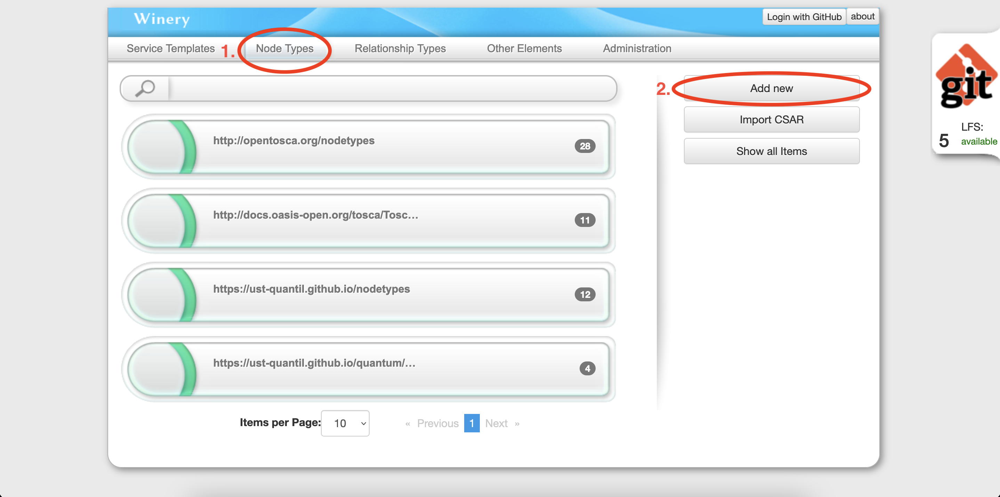

Enter the following values into the dialog and click on `Add`:

| Field | Value | Explanation |
|:-------|:------|:---------------|
| Name | CustomQiskit | |
| Versioning | Enabled | (optional) |
| Version | latest | (optional) |
| Namespace | `https://ust-quantil.github.io/nodetypes` ||

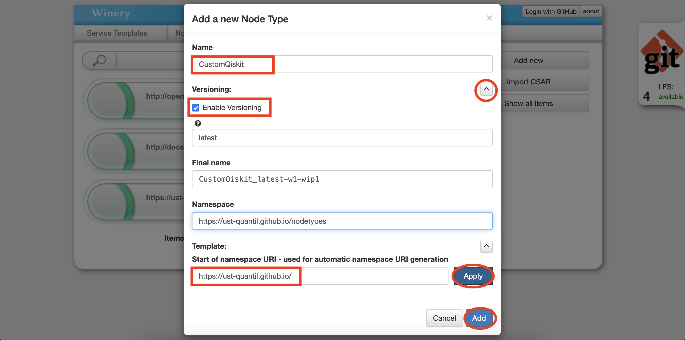

Optionally create a README, choose a license and customize the node appearance.

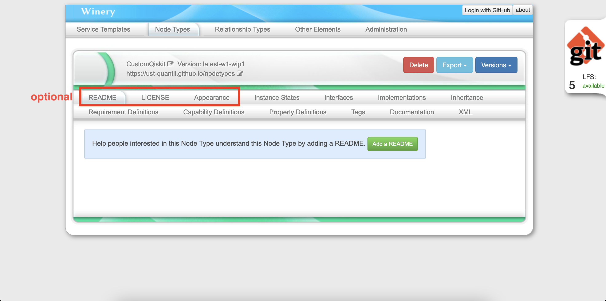

:information_source: In the case that an existing node should be extended, go to the inheritance tab and select the node type to inherit from.


### 3. Define Node Properties

The original Qiskit node does not have a *property*, but for this tutorial, we will define one. Open the `Property Definitions` tab.

Select `Custom key/value pairs` to create new properties. Then click on the `Add` button to create a new Property.

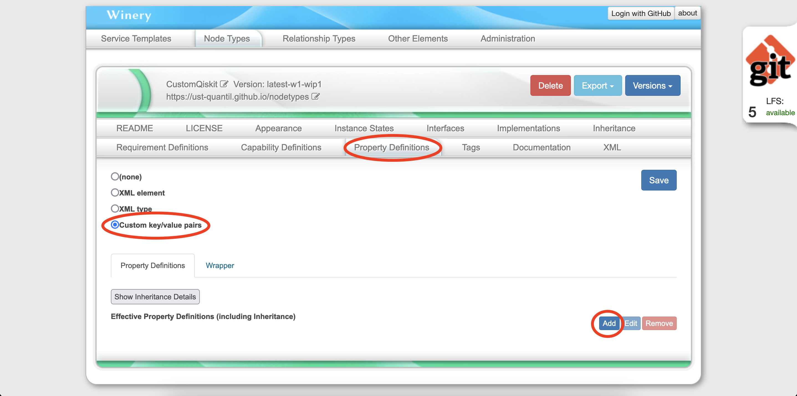

| Field | Value | Explanation |
|:-------|:------|:---------------|
| Name | `qiskitVersion` | |
| Type | `xsd:string` | data type |

Leave the rest empty and hit `Save`.


### 4. Create the Lifecycle Interface

A *Node Type* in TOSCA needs to define *interfaces* that contain the *methods* that can be called/executed on that node type.

First, open the `interfaces` tab.

Click on the `Generate Lifecycle Interface` to create a new lifecycle interface for this *Node Type*.

:information_source: The lifecycle interface defines methods for, e.g., installing, configuring, and starting a *Node Type*.

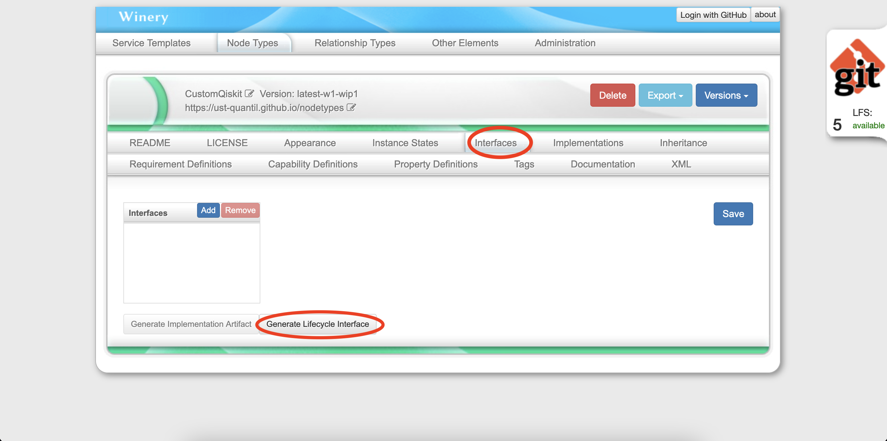

For our Qiskit node, we only need to install the dependency so we can delete all other methods of the lifecycle interface.

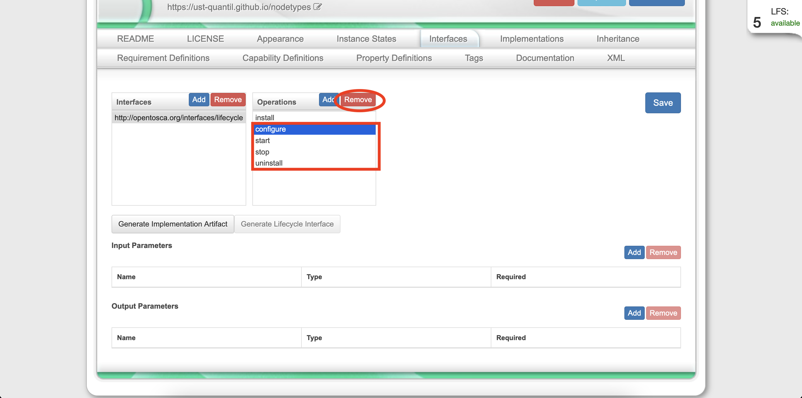

Click on the `install` method to define input parameters. Then, click on the `Add` button of the input parameters.

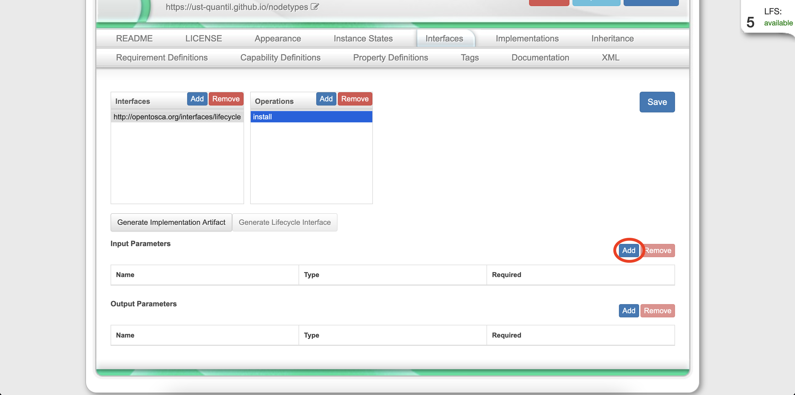

| Field | Value | Explanation |
|:-------|:------|:---------------|
| Name | `qiskitVersion` | |
| Type | `xsd:string` | data type |
| Required | False | if the user needs to supply a value |

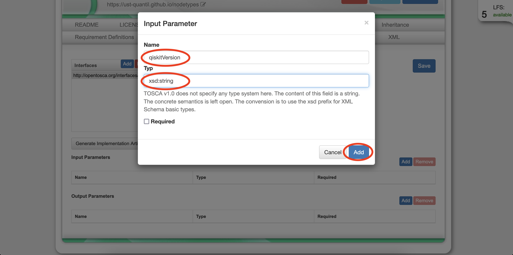

Hit `Add` to add the input parameter and `Save` to save the changes you made.
This makes the (optional) `qiskitVersion` property available to all implementations of this interface method.

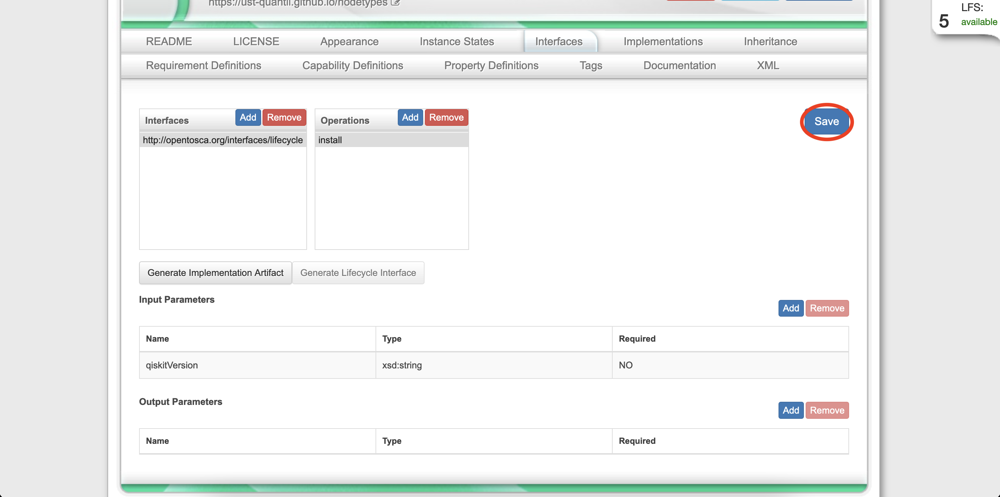

:information_source: The properties can come from the same node, or any node this node depends on in a topology (e.g., with a hostedOn edge). Therefore, it is good to choose unique names for properties that should not be used generically (i.e. `qiskitVersion` instead of `version`).


### 5. Create the Connection Interface

Nodes that can connect to other nodes, e.g. our Qiskit node should be able to connect to the IBMQ cloud, need an interface implementing that connection.
Click on the `Add` button of interfaces to create a new one.

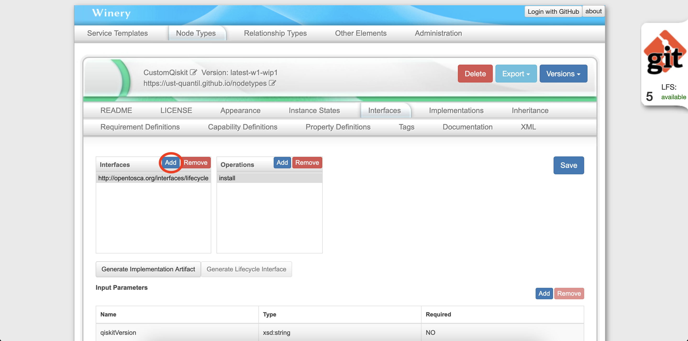

| Field | Value | Explanation |
|:-------|:------|:---------------|
| Name | `http://opentosca.org/interfaces/connectTo/ibmq` | |

:information_source: The interface name can be freely chosen for this. Opentosca will execute **any** interface with a *connectsTo* method for a *connectsTo* node relation. This can be used to implement multiple different connections. However, it is a good practice to include the connection type in the interface name.

Select the created interface and add a new operation.

| Field | Value | Explanation |
|:-------|:------|:---------------|
| Name | `connectTo` | |

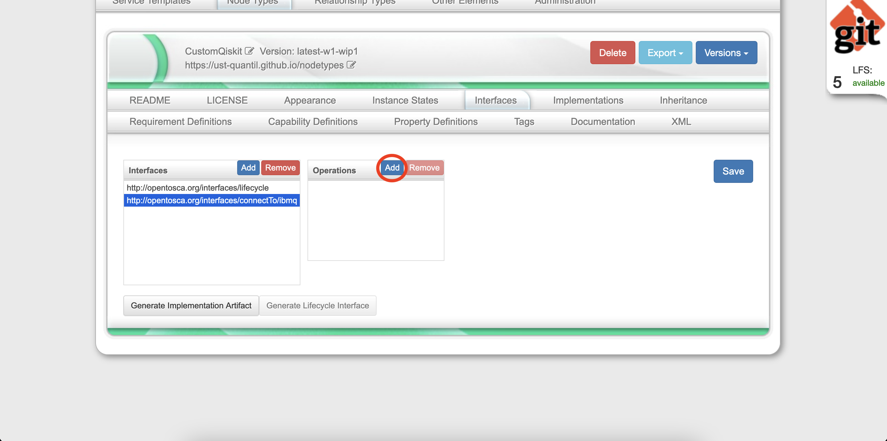

Add the following input parameters:

| Name | Type | Required |
|:-------|:------|:---------------|
| IBMQ_TOKEN |xsd:string | NO |
| PROVIDER |xsd:string | NO |
| IBMQ_BACKEND_NAME |xsd:string | NO |
| IBMQ_GROUP |xsd:string | NO |
| IBMQ_PROJECT |xsd:string | NO |
| IBMQ_HUB |xsd:string | NO |

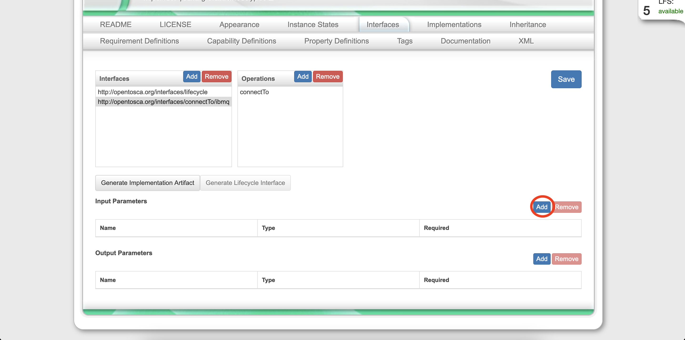

:information_source: Interface methods will only be called if their properties can be satisfied/filled in => use this to differentiate between different connectsTo implementations

Save the changes you made.

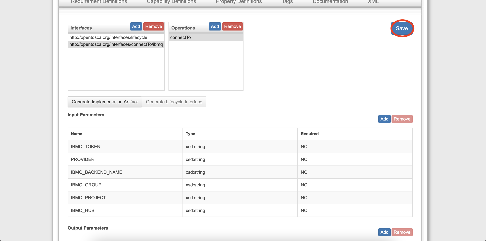

### 6. Add an Implementation

Open the `implementations` tab and click on `Add` to create a new implementation.

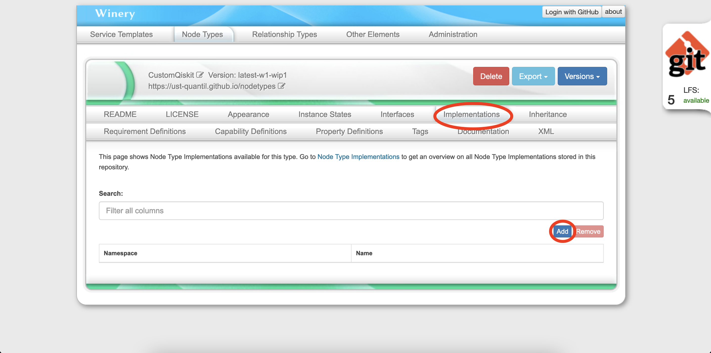

| Field | Value | Required |
|:------|:------|:---------|
| Enable Versioning | True | No |
| Namespace | `https://ust-quantil.github.io/nodetypeimplementations` | YES |

Use the default values for the rest of the fields.

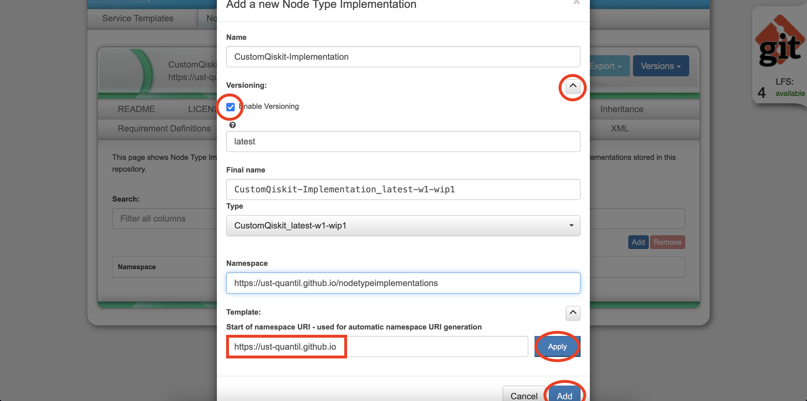

The new implementation opens automatically.


## Implement the Node Type

### 1. Add infos (optional)

Go to the new implementation if it is not open already.
Here you can add a readme and license if you want.

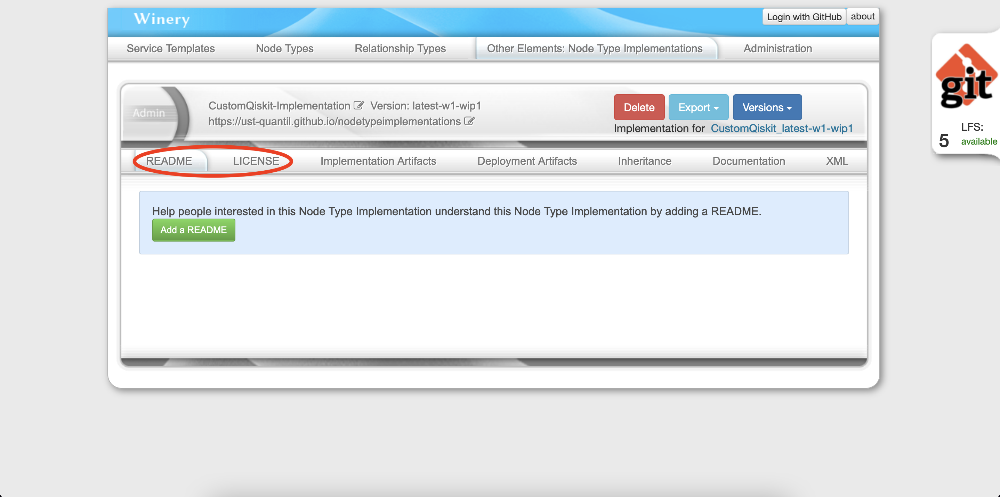

### 2. Create Lifecycle implementation

Go to the *`implementation artifacts`* tab.
Add the `install` artifact.

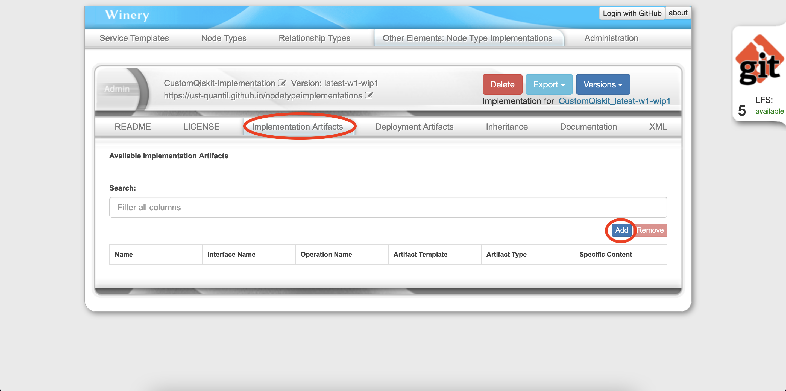

Enter the following values:

| Field | Value | Required |
|:------|:------|:--------|
| Name | Qiskit_Install | Yes |
| Interface Name | http://opentosca.org/interfaces/lifecycle | Yes |
| Operation Name | install | Yes |
| Artifact Template Creation | Create Artifact Template | Yes |
| Enable Versioning | True | No |
| Type | ScriptArtifact | Yes |
| Namespace | https://ust-quantil.github.io/artifacttemplates | Yes |

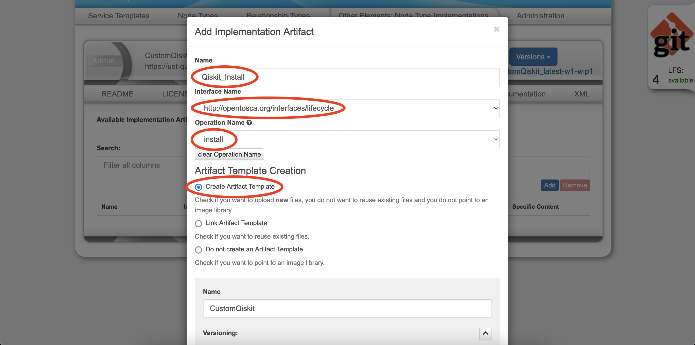

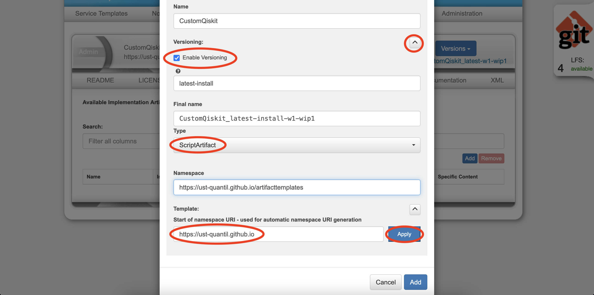

Upload the script [install.sh](./images/new_node_type/implementations/implementation_artifacts/install.sh):

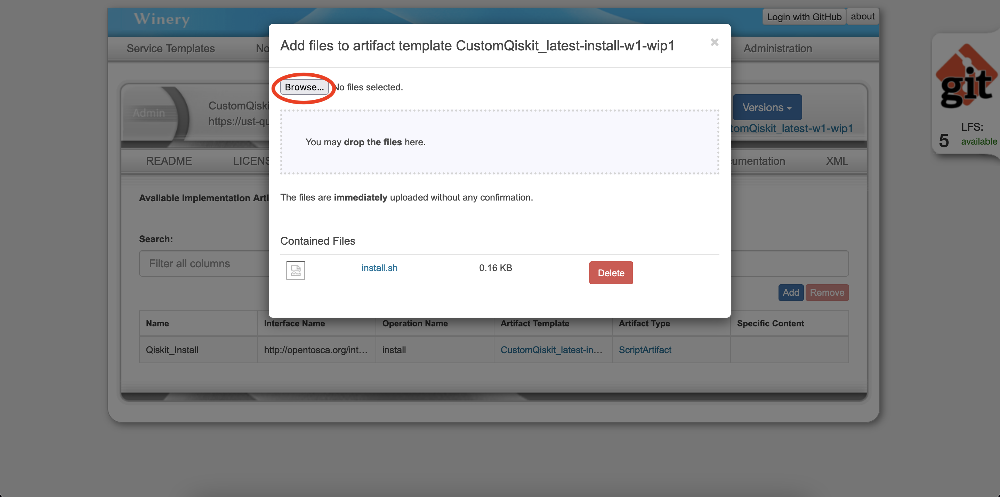

### 3. Explanation of the install script

```bash
#!/bin/bash

sudo apt-get update -qq
sudo DEBIAN_FRONTEND=noninteractive apt-get install -y python3-pip -qq
    
pip3 install --upgrade pip
pip install qiskit==${qiskitVersion}

```

This script installs Pip, updates it, and then installs Qiskit with the specified version.
The version can be specified with the input parameter `qiskitVersion` of the install interface and is available in the script as an environment variable.

### 4. Create ConnectsTo implementation

Add the `connectTo` artifact.
Enter the following values:

| Field | Value | Required |
|:------|:------|:--------|
| Name | Qiskit_ConnectTo | Yes |
| Interface Name | http://opentosca.org/interfaces/connectTo/ibmq | Yes |
| Operation Name | connectTo | Yes |
| Artifact Template Creation | Create Artifact Template | Yes |
| Enable Versioning | True | No |
| Type | ScriptArtifact | Yes |
| Namespace | https://ust-quantil.github.io/artifacttemplates | Yes |

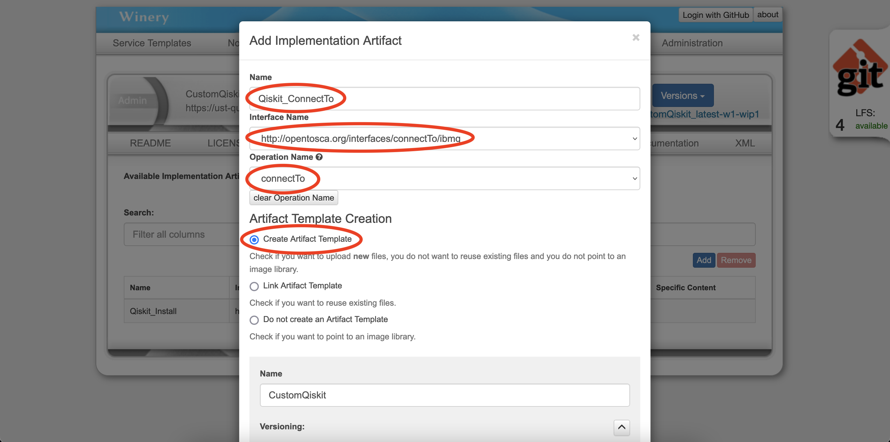
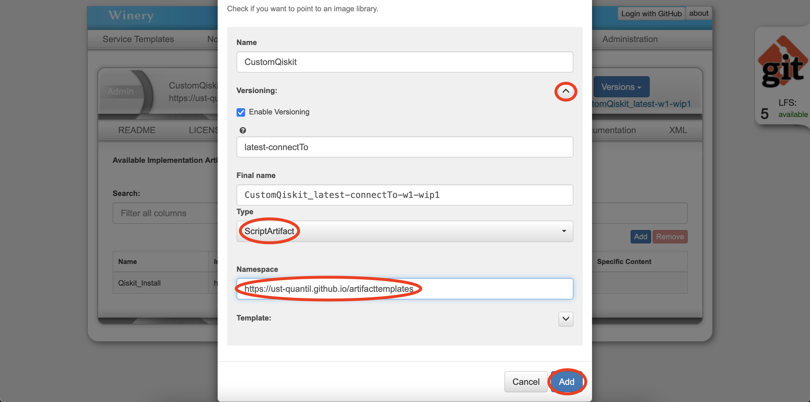

Upload the script [connectTo.sh](./images/new_node_type/implementations/implementation_artifacts/connectTo.sh):

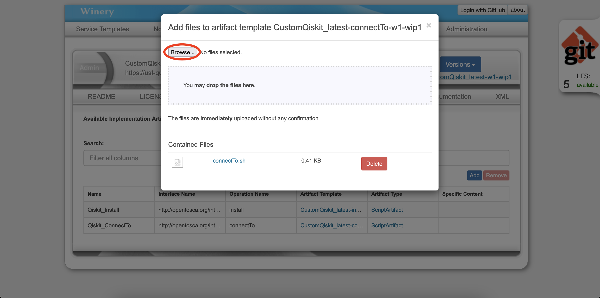

:information_source: Multiple connectTos with config updates: Restart things if needed; Write config to disc; PID files

### 5. Explanation of the ConnectTo script

```bash
#!/bin/bash

sudo mkdir -p qiskit_app

echo "PROVIDER=${PROVIDER}" >> qiskit_app/.env

echo "AER_BACKEND_NAME=${AER_BACKEND_NAME}" >> qiskit_app/.env

echo "IBMQ_TOKEN=${IBMQ_TOKEN}" >> qiskit_app/.env
echo "IBMQ_BACKEND_NAME=${IBMQ_BACKEND_NAME}" >> qiskit_app/.env
echo "IBMQ_HUB=${IBMQ_HUB}" >> qiskit_app/.env
echo "IBMQ_GROUP=${IBMQ_GROUP}" >> qiskit_app/.env
echo "IBMQ_PROJECT=${IBMQ_PROJECT}" >> qiskit_app/.env
```

This script helps to make the user input available to the Qiskit application.
Again, the values of the input parameters are available in environment variables.
This script writes the values of the input parameters of the `connectTo` interface to the file `qiskit_app/.env`.
The Qiskit application can then read these values from the file.

## Example of a PythonScriptArtifact
So far we have implemented all methods as bash scripts. But Python scripts are supported as well.
The following example script installs `deployment artifacts` and requirements of the `Node Type` QHAna-PluginRunner version latest-w2.

```python
# !/usr/bin/env python
import sys
import subprocess
from collections import ChainMap
from os import environ
from pathlib import Path
from zipfile import ZipFile
from shutil import copyfile
from shlex import join as cmd_join
from subprocess import PIPE


def argv_to_dict(argv):
    return dict(arg.split('=', maxsplit=1) for arg in argv if '=' in arg)


def printOutput(dict):
    for key in dict:
        print(str(key) + '=' + str(dict[key]))


def install_requirements(environ):
    cmd = ['apt-get', 'update', '-qq']
    print(cmd_join(cmd))
    subprocess.run(cmd)
    cmd = ['apt-get', 'install', 'git', '-qq']
    print(cmd_join(cmd))
    subprocess.run(cmd)


def install_deployment_artifacts(environ):
    das = (da.strip() for da in environ.get('DAs', '').split(';') if da.strip())
    plugin_runner_found = False
    for da in das:
        print('DA:', da)
        result = da.split(',', maxsplit=1)
        da_path = Path('/') / environ.get('CSAR', '').strip('/') / result[1].lstrip('/')
        if da_path.suffix == '.zip':
            if result[0] == 'QHAna-PluginRunner_DA':
                plugin_runner_found = True
                print('install plugin runner DA', *result)
                install_plugin_runner(da_path)
            else:
                print('install plugin DA', *result)
                install_plugin(da_path)
    if not plugin_runner_found:
        print('ERROR: No plugin runner DA!!!')


def extract_zip(source, target):
    target.mkdir(parents=True, exist_ok=True)
    with source.open(mode='rb') as zip_file:
        ZipFile(zip_file).extractall(target)


def install_plugin_runner(zip_da):
    if not zip_da.exists():
        print('ERROR: DA not found at ', zip_da)
        return
    target = Path('src')
    extract_zip(zip_da, target)
    # TODO unpin versions if possible
    cmd = ['python3', '-m', 'pip', 'install', 'PyMySQL', 'poetry', 'mysql-connector-python==8.0.26']
    print(cmd_join(cmd))
    subprocess.run(cmd)
    for f in ['tasks.py', 'pyproject.toml', 'poetry.lock']:
        copyfile(target / f, Path('.') / f)
    cmd = ['python3', '-m', 'poetry', 'export', '--without-hashes']
    requirments = subprocess.run(cmd, stdout=PIPE)
    req_file = Path('requirements.txt')
    with req_file.open(mode='w') as f:
        f.write(f'{target.resolve()}\n')
        f.write(requirments.stdout.decode())
    cmd = ['python3', '-m', 'pip', 'install', '-r', str(req_file.resolve())]
    print(cmd_join(cmd))
    subprocess.run(cmd)


def install_plugin(zip_da):
    if not zip_da.exists():
        print('ERROR: DA not found at ', zip_da)
        return
    extract_zip(zip_da, Path('plugins'))


def post_install(environ):
    extra_env = {
        'FLASK_APP': 'qhana_plugin_runner',
        'FLASK_ENV': 'production',
        'PLUGIN_FOLDERS': 'plugins:git-plugins'
    }

    cmd = ['python3', '-m', 'invoke', 'load-git-plugins']
    print(cmd_join(cmd), 'env:', extra_env)
    subprocess.run(cmd, env=ChainMap(extra_env, environ))
    cmd = ['python3', '-m', 'flask', 'install']
    print(cmd_join(cmd), 'env:', extra_env)
    subprocess.run(cmd, env=ChainMap(extra_env, environ))


def main(argv):
    print('pwd', Path('.').resolve())
    print(argv)
    env = ChainMap(argv_to_dict(argv), environ)
    install_requirements(env)
    install_deployment_artifacts(env)
    post_install(env)


if __name__ == "__main__":
    main(sys.argv[1:])
```

### Explanation

`PythonScriptArtifacts` get the user input not as environment variables but as command-line arguments.
The function `argv_to_dict` converts the command-line arguments to a dictionary for easy access.
The `ChainMap` class is used to merge multiple dictionaries, i.e., to merge the command-line arguments with the environment variables.
`install_requirements` installs git.
The file names of the `deployment artifacts` are passed as environment variables to the script under the key `DAs`, and the path to the unzipped `CSAR` folder can be found under the key `CSAR`.
The function `install_deployment_artifacts` calculates the paths to the `deployment artifacts`,
checks the type, and calls the right install functions.
`install_plugin_runner` unpacks the passed `deployment artifact` and installs required Python packages, `install_plugin` unpacks the passed `deployment artifact` into the plugins folder.
In the end, `post_install` executes commands to configure the application and install more dependencies.


## Deployment Artifacts

`Deployment artifacts` implement the business logic of an application, e.g., the jar file for a Tomcat web server.
If you want to create a node type that has, e.g., a jar file as a deployment artifact, you need to create an interface with an implementation artifact that can execute this file.

**Example with a jar file as deployment artifact**
- create a `Node Type`
- create an `interface` with a `start operation` for this `Node Type`
- create a `node type implementation` for this `Node Type`
- add a `deployment artifact` to the `node type implementation`

- upload the `jar file` to the `deployment artifact`
- add a `ScriptArtifact` as `implementation artifact` for the `start operation` to the `node type implementation`

- upload a `script` to the `ScriptArtifact` that executes the `jar file`

Example script to execute a `jar file`:
```bash
#!/bin/bash

echo "Starting QHana-Backend"

cd qhana_backend
java -jar qhana_backend.jar
echo "Done"

sleep 5
```

## Tips and tricks

**Access input parameters of source and target nodes:**
In an `implementation artifact` of a `connectTo` interface, you can prefix environment variables with `SOURCE_` or `TARGET_` to specify whether you want the input parameter of the source or target node, respectively.
This helps in cases where the source and target node have a property with the same name.

**Ways to debug implementations:**
- Enter the container and execute the implementation manually
- Write debug information (logs) to a file, then copy that file from the container to your disk
